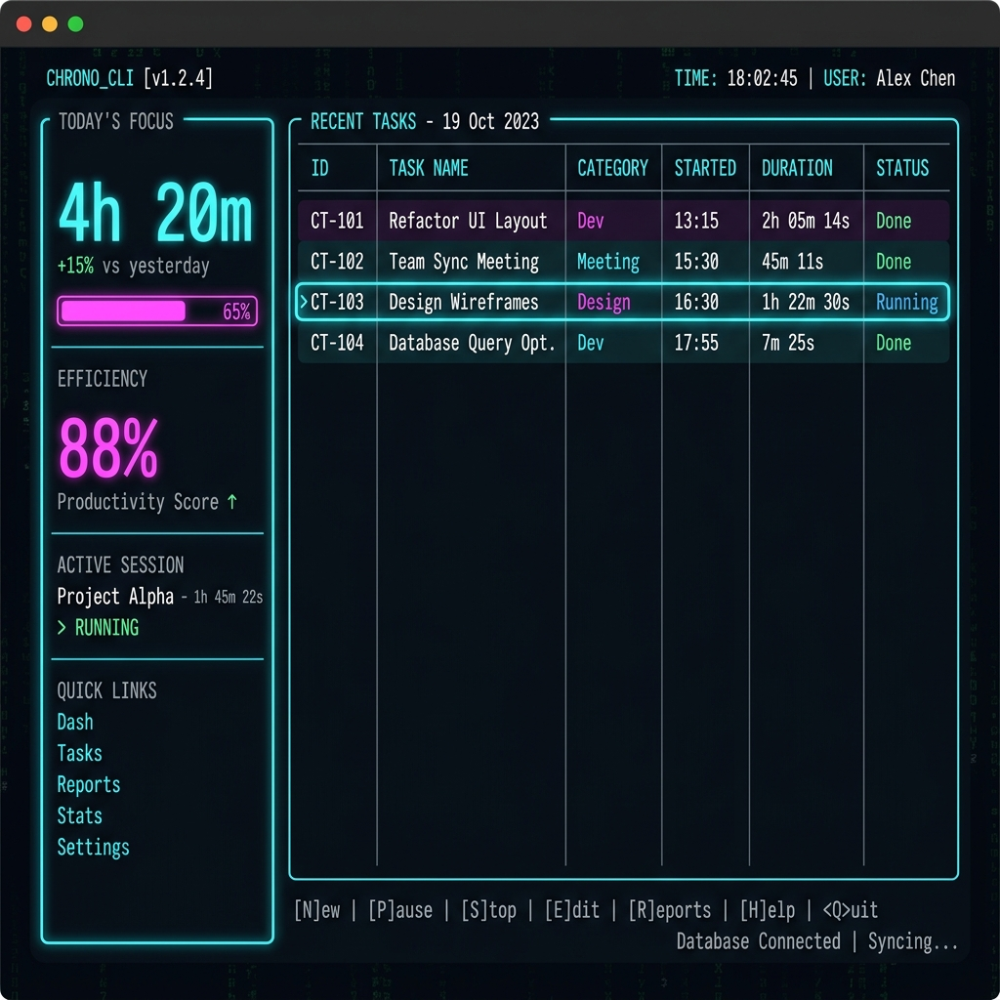

# ChronoCLI ⏱️🚀

[](https://pypi.org/project/chronocli/)
[](https://opensource.org/licenses/MIT)
[](https://www.python.org/downloads/)

**ChronoCLI** is a professional, AI-powered command-line time tracker designed for modern workflows. It combines a beautiful TUI dashboard with deep productivity insights powered by Groq's Llama-3.3.



## ✨ Features

- **🎯 Precise Tracking**: Effortless session management with smart start/stop commands.
- **🤖 AI productivity Coach**: Personalized feedback and burnout warnings based on your data.
- **📊 Interactive TUI**: A premium terminal dashboard built with `Textual`.
- **📈 Advanced Analytics**: Weekly AI summaries and detailed productivity reports.
- **📁 Professional Exports**: Generate sleek PDF and CSV reports for clients or personal tracking.
- **🔒 Privacy First**: Your data stays local in a SQLite database; AI analysis is secure via Groq.

## 🚀 Quick Start

### 1. Installation
```bash
pip install chronocli
```

### 2. Setup
Add your Groq API Key to your environment or a `.env` file:
```bash
GROQ_API_KEY=your_api_key_here
```

### 3. Usage
```bash
# Start a task
chronocli track start "Designing UI" --category "Design"

# Stop current task
chronocli track stop

# Launch the Dashboard
chronocli dashboard
```

## 🧠 AI Commands
ChronoCLI isn't just a timer; it's a coach.

- `chronocli coach`: Get a deep dive into your work habits.
- `chronocli ai-weekly`: A structured breakdown of your weekly performance.
- `chronocli ask "What is my most productive hour?"`: Query your data using natural language.

## 🛠️ Tech Stack
- **CLI Framework**: [Typer](https://typer.tiangolo.com/)
- **UI Engine**: [Textual](https://textual.textualize.io/)
- **Data Layer**: [SQLModel](https://sqlmodel.tiangolo.com/)
- **AI Integration**: [Groq Cloud](https://groq.com/)
- **Formatting**: [Rich](https://rich.readthedocs.io/)

## 📜 License
Distributed under the MIT License. See `LICENSE` for more information.

---
Built with ❤️ for the terminal community.
